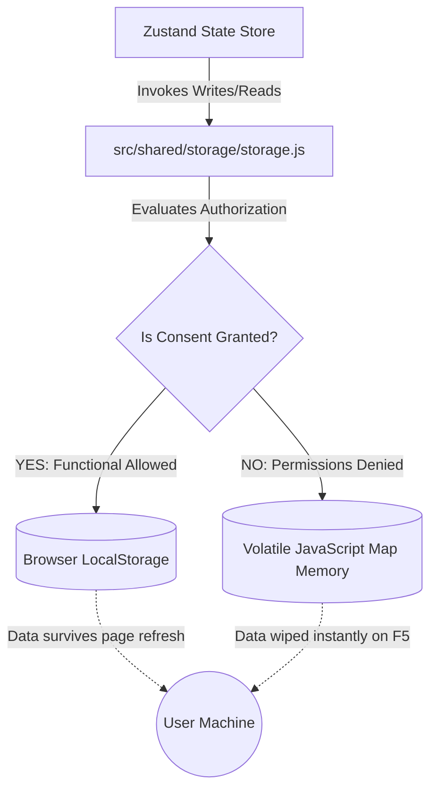

# GDPR-Compliant Storage Facade

Writing tracking arrays, high scores, or authentication data to a user's persistent file system without explicit consent breaks global privacy legal frameworks (GDPR).

To remain fully compliant without breaking user experience, this application leverages an abstract **Storage Facade**.

## Behavioral State Flow

The state management slices (e.g., Zustand persistence configurations) never call raw browser APIs like `localStorage.setItem` directly. Instead, they proxy all state-saving activities through our unified shared layer.



## Structural Implementation

The authorization gate dynamically checks the active memory configurations before permitting a state slice to write data to disk.

```javascript title="src/shared/storage/storage.js"
function isStorageAllowed(key, category) {
    // The core consent key must always read/write to prevent systemic lockouts
    if (key === CONSENT_KEY) return true;
    
    const consent = getConsent();
    if (!consent.isSet) return false;
    
    return !!consent[category];
}
```

:::tip Volatile Fallback Strategy
When a player clicks **"Reject All"** in the `<CookiePopup />`, `isStorageAllowed` returns `false` for functional profiles. The facade silently redirects write instructions to an internal in-memory data cache:
```javascript
const localMemoryStorage = new Map();
```
The game continues to run flawlessly. The user can log in, track scores, and complete rounds. However, because the data resides inside a temporary RAM stack, hitting **F5 (Refresh)** or closing the tab instantly purges the state, leaving zero local footprint behind.
:::

:::danger System Integration Warning
Never import or instantiate any direct `localStorage` or `sessionStorage` scripts outside the `src/shared/storage` scope. Bypassing the facade introduces compliance leaks and triggers strict ESLint build failures.
:::